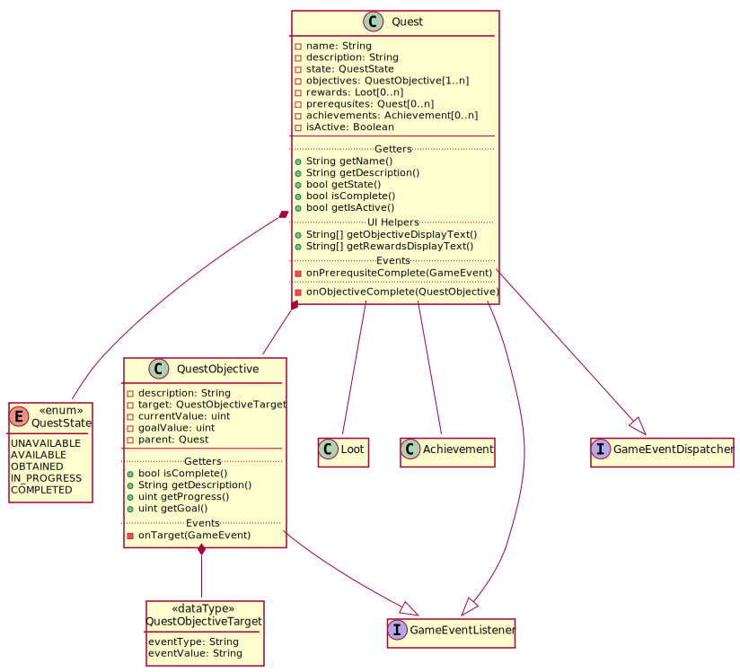

# 6ft

## Quest System

### Brief

Design a Quest System interface in C++. Design data structures, classes, function signatures, and DB tables supporting a player questing system with the following characteristics.

Quest States:

``` c++
UNAVAILABLE // unavailable for whatever reason
AVAILABLE   // available but not yet obtained
OBTAINED    // obtained with no objectives completed
IN-PROGRESS // obtained with some objectives completed
COMPLETED   // obtained with all objectives completed
```

Other Requirements:

- Quests can have prerequisites that must be completed to transition to the AVAILABLE state
- Quests allow "N of M objectives, N<=M" for transition to the COMPLETED state
- Quests in the COMPLETED state can grant achievements

Be sure to explain any assumptions your design makes using code comments.

### Assumptions

- A1.0 The quest system is for a MMORPG.
  - A1.1 Quests can be added to the game.
  - A1.2 Quests can be gobally disabled (such as holiday or event-related quests).
  - A1.3 Quests can only be updated while the game servers are in maintance mode.
- A2.0 All objects in game can have a UUID.
  - A2.1 Given a UUID, an object can be created.
  - A2.2 Given an object, a UUID can be derived.
  - A2.3 UUIDs and objects can be used interchangably.
  - A2.4 A UUID exists for every player character.
- A3.0 There exists a robust event system.
  - A3.1 Events provide an event type (`ENEMY_KILLED`, `ITEM_COLLECTED`, `VOLUME_ENTERED`, _et cetera_).
  - A3.2 Events provide a value referencing a game object (`Enraged_Panther`, `Refined_Ore`, `Enemy_Base_Entrance`, _et cetera_).
  - A3.3 The event system provides an interface for recieving events, `IGameEventListener`.
  - A3.4 The event system provides an interface for sending events, `IGameEventDispatcher`.
- A4.0 Quest objectives are based on discrete, numerical values, such as:
  > - __Bless Pirates__ 13/20
  > - __Taste Pies__ 5/8
  > - __Complete Programming Test__ 0/1
- A5.0 There exists a Loot object that can support any possible quest rewards.
- A6.0 There exists a robust ORM to handle database I/O.

### Design Approach

#### Class Diagram

 [View as PNG](out/quest-system-class-diagram/quest-system-class-diagram.png)

#### State Diagram

 [View as PNG](out/quest-system-event-diagram/quest-system-event-diagram.png)

#### Accepting Quests

When a quest is available, it will appear in-game for the Player. When a player accepts the quest, it will transition to `ACCEPTED`, and each of the quest objectives will begin to listen for their assigned game events.

#### Completing Objectives & Quests

Whenever a `QuestObjective` recieves a matching game event, it will increment `currentValue`. If `currentValue` matches or exceeds `goalValue`, it will alert its associated quest by calling `parent.onObjectiveComplete()`.

Whenever `onObjectiveComplete()` is called, the `Quest` it will check `isComplete()` for each objective in `objectives`. If all objectives are complete, it will dispatch a game event to notify all quests that it has been completed, update each achievement in `achievements` and transition to `COMPLETE`.

#### Becoming Available

When `onPrerequsiteComplete()` is triggered from a quest completion event, the quest will check `isComplete()` for each `Quest` in `prerequsites`. If they are all complete and if `isAvailable`, the quest will transition to `AVAILABLE`.


#### Becoming Unavailable

When connecting to the server, the player will query the database. Any quest where `!isAvailable` will be transitioned to `UNAVAILABLE` unless `COMPLETE`.

### Global Database

The global database provides all information regarding the global values of the game. It does not contain player information.

#### Quests

`Quests` provides the name and description of quests, and allows for turning a quest on or off globally.

|Key|Type|Column|Relation|
|---|----|------|--------|
|PK |UUID|questId|        |
||VARCHAR|name||
||VARCHAR|description||
||BOOLEAN|isAvailable||
|FK1|UUID|reward|`Loot.lootId` (_from **A5.0**_)|

#### Prerequsites

`Prerequsites` provides a mapping of quests to prerequsites.

|Key|Type|Column|Relation|
|---|----|------|--------|
|PK |UUID|prerequsiteID|        |
|FK1|UUID|quest|`Quests.questId`|
|FK2|UUID|prerequsite|`Quests.questId`|

#### QuestObjectives

`QuestObjectives` provides the description and details of quest objectives, as well as mapping to their quests.

|Key|Type|Column|Relation|
|---|----|------|--------|
|PK|UUID|questObjectiveId||
|FK1|UUID|parent|`Quests.questId`|
||VARCHAR|description||
|FK2|UUID|type|`EventType.eventTypeId` (_from **A3.1**_)|
|FK3|UUID|value|`GameObject.gameObjectId` (_from **A2.0**_)|
||INTEGER|goal||

#### QuestStates

`QuestStates` provides all possible states a quest could be in.

|Key|Type|Column|Relation|
|---|----|------|--------|
|PK|UUID|questStateId||
||VARCHAR|name||

#### QuestAchievements

`QuestAchievements` provides mapping between quests and achievements.

|Key|Type|Column|Relation|
|---|----|------|--------|
|PK |UUID|questAchievementId||
|FK1|UUID|quest|`Quests.questId`|
|FK2|UUID|achievement|`Achievement.achievementId` (_from Requirements_)|

### Character Database

The character database provides individual player character progression information.

### CharacterQuests

`CharacterQuests` relates individual progression from characters to quests.

|Key|Type|Column|Relation|
|---|----|------|--------|
|PK|UUID|characterQuestId||
|FK1|UUID|character|`Characters.characterId` (_from **A2.4**_)|
|FK2|UUID|quest|`Quests.questId`|
|FK3|UUID|state|`QuestState.questStateId`|

### CharacterObjectives

`CharacterObjectives` relates individual progression from characters to objectives.

|Key|Type|Column|Relation|
|---|----|------|--------|
|PK|UUID|characterObjectiveId||
|FK1|UUID|character|`Characters.characterId` (_from **A2.4**_)|
|FK2|UUID|objective|`QuestObjectives.questObjectiveId`|
||INTEGER|value||

